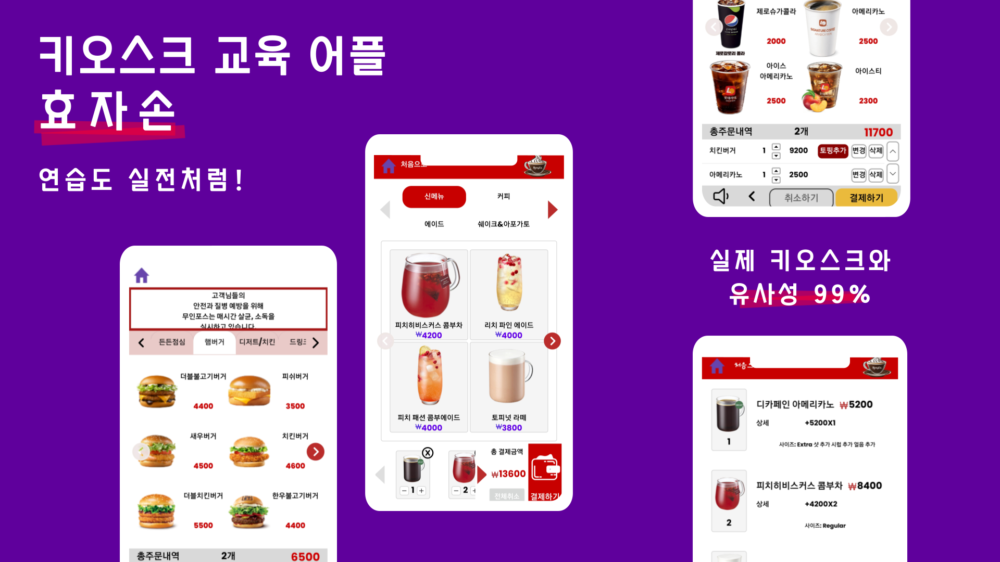
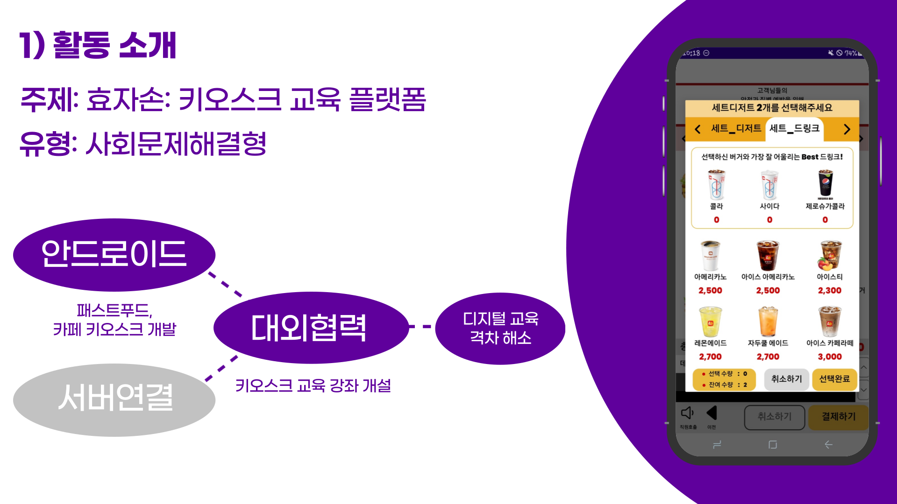
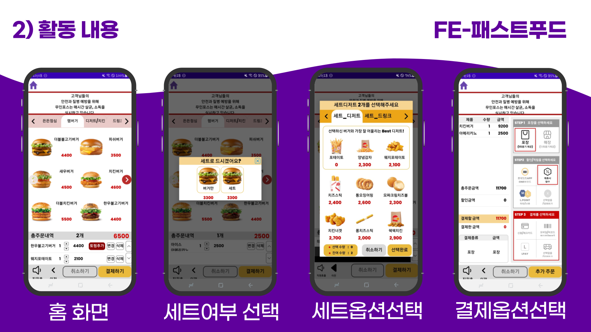
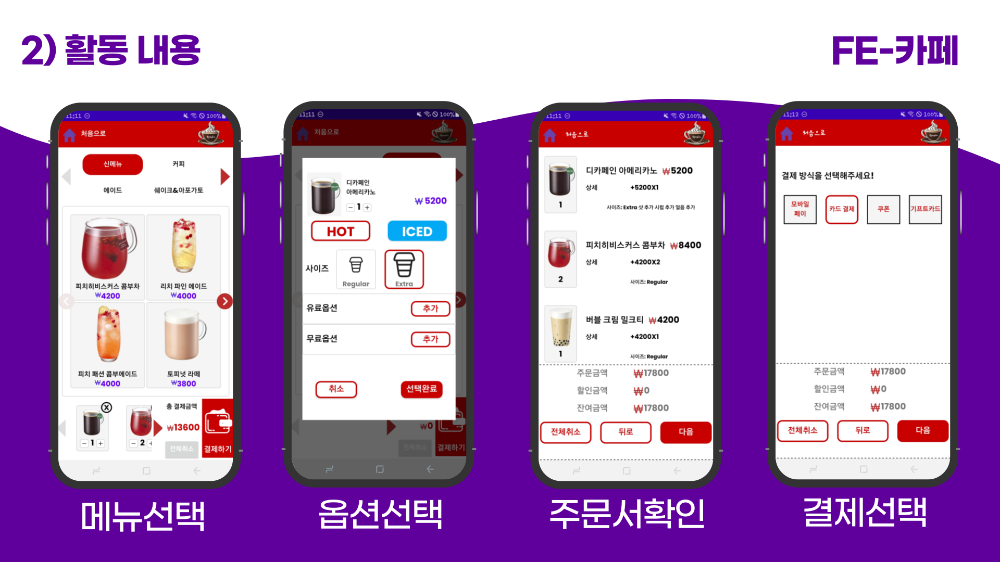
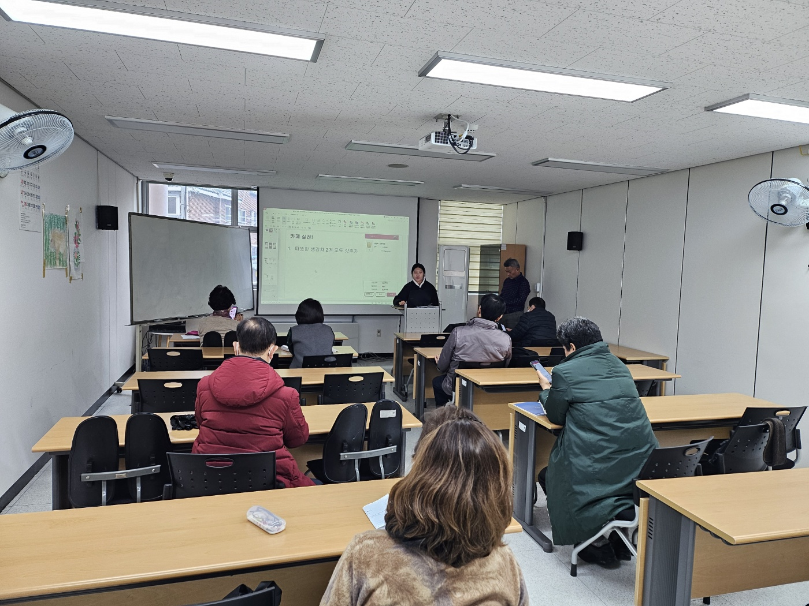
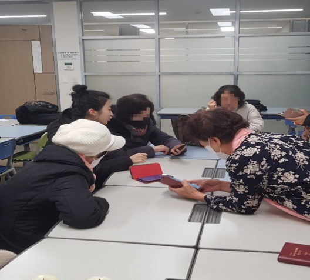
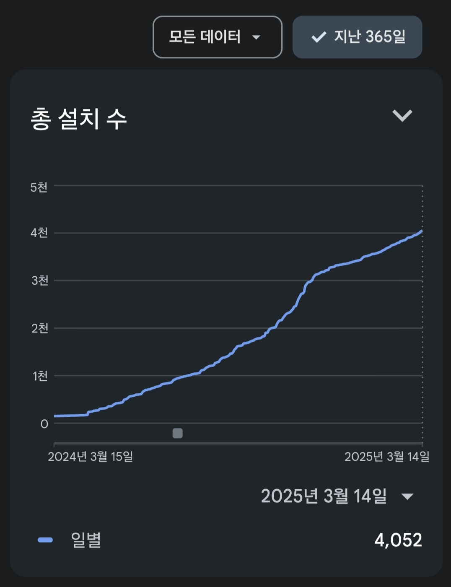

  <h1>🧓 효자손 : 노인 키오스크 교육 플랫폼</h1>
  <h3>2024 2학기 건국대학교 자기전공설계 3위
  </h3>

  
   

  <h2><a href="https://play.google.com/store/apps/details?id=com.dream.hyoja">[🔗 구글 플레이 스토어 Click !]</a> 👈</h2>

  <a href="https://admitted-seat-34f.notion.site/6f12fa6e848d467d8347e4384b5b3040?pvs=4">Notion 바로 가기</a>

 
 

# 🛠 기술 스택

  
   
  
  
  </a>

 

# 💡 프로젝트 소개

  

# 💡 주요 기능
`Android Jetpack` `ViewModel` `LiveData` `Lifecycle` `RecylcerView` `AppCompat` `Data Binding` 

  
   
     
  

 

#  🏆 성과

  <h2><a href="https://www.konkuk.ac.kr/konkuk/2096/subview.do?enc=Zm5jdDF8QEB8JTJGYmJzJTJGa29ua3VrJTJGMjU3JTJGOTM5Njk5JTJGYXJ0Y2xWaWV3LmRvJTNGcGFnZSUzRDMlMjZzcmNoQ29sdW1uJTNEJTI2c3JjaFdyZCUzRCUyNmJic0NsU2VxJTNEJTI2YmJzT3BlbldyZFNlcSUzRCUyNnJnc0JnbmRlU3RyJTNEJTI2cmdzRW5kZGVTdHIlM0QlMjZpc1ZpZXdNaW5lJTNEZmFsc2UlMjZwYXNzd29yZCUzRCUyNg==">📰 건국대학교 뉴스 레터</a> 👈</h2>

### 1️⃣ 원데이 클래스 4회

- 수원 권선동 성당 ‘스마트폰 강좌’
- 동부밑거름학교
- 성동구민대학 ‘스마트폰 기초 · 중급’ 2회

 

  
  

### 2️⃣실제 다운로드 수  4000 +
 

  

